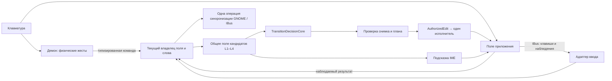

# Канон архитектуры Lay

Статус: обязательный контракт разработки. Соблюдение контракта конкретной
версией доказывается проверками; этот документ не объявляет текущий runtime
исправным. Дата принятия: 2026-09-26.

Это точка входа для человека и любого агента. Начать с [AGENTS.md](AGENTS.md),
затем прочитать этот файл и документ владельца затронутого механизма.
Исторический отчёт, граф зависимостей и память модели не меняют контракт.
Прямое указание пользователя определяет разрешённый объём работы; конфликт
между ним и контрактом нужно явно назвать и оформить как решение.

## Границы системы

Схема задаёт границы ответственности, а не требование нового процесса или
общего глобального буфера. Обычный ввод пользователя, явное принятие окончания,
ручная смена раскладки слова и автоматическое исправление имеют разные
основания. Общими остаются проверка текущего поля и право исполнить операцию.

## C01 — Источник и версия должны быть установлены

Перед изменением установить checkout, commit и незакоммиченные изменения.
Перед выводом о live-поведении установить загруженные байты и конфигурацию.
Название ветки, версия CLI, опубликованный релиз и успешный тест другой ветки
не доказывают идентичность работающего маршрута. Датированные наблюдения
остаются датированными. Чужие незавершённые изменения сохраняются.

## C02 — Один выбор семантического действия

L1/L1.1 дают свидетельства, L2 сохраняет решётку кандидатов, L3/L4/Bayes дают
дополнительные основания. `TransitionDecisionCore` выбирает действие.
Производитель кандидата, IME, демон и вывод не создают собственный обход
решения. Проверяющий модуль проверяет выбранное действие, не ранжирует заново.
Правила сохранения кандидатов и качества остаются в
[каноне L1–L4](docs/phase-word-recovery-canonical-cutover.md) и
[каноне L2/L1.1](docs/l2-l11-canonical-architecture.md).
Пример из переписки не становится условием или весом runtime.

## C03 — Один владелец права на текущее слово

Право связано с конкретными полем, фокусом, владельцем и ревизией ввода.
В актуальном IME этот контур принадлежит `ContextAdmissionReducer`;
`WindowInteraction` связывает наблюдение, допуск, исполнение и завершение.
Использовать существующие владельцы и типы. Зеркало текста демона, локальная
композиция IME и снимок клиента имеют разные гарантии и не подменяют друг друга.
Передача между ними явная и ограниченная конкретной операцией.
Новый владелец, таймер, очередь, кеш или fallback требует причины, рассмотрения
существующего механизма и границы удаления заменяемого пути.

## C04 — Один физический жест, одно действие

На managed-маршруте физический Double Shift распознаёт демон; IME получает
команду через `ManualToggleV3`. Наблюдение тех же Shift через IBus не должно
запускать второе переключение. Зажатый Shift является состоянием модификатора,
не последовательностью ручных переключений. Передача исполнения не запускает
повторный выбор слова из другого буфера. Повторные жесты в том же поле должны
сохранять корректную последовательность преобразований.

## C05 — Одна проверенная операция, один исполнитель

Планируемое исправление или замена проходит через существующие `EditAction`,
verifier/`SafetyGate` и `AuthorizedEdit`. Решающий слой не печатает и не удаляет
текст. Делегирование связывает точный текст, снимок и исполнитель, а не только
флаг «попробовать другим backend». Нет автоматического повторного исполнения
после неизвестного или частичного результата. Обычная передача физических
клавиш не считается автоматическим исправлением.

## C06 — Показ, принятие и применение имеют разные основания

Видимая подсказка сама по себе не разрешает изменение текста. Принятие Tab
проверяет актуальность показанного кандидата и текущего поля; добавление
окончания нельзя расширять до разрешения удалить или заменить слово.
Ожидаемый пользовательский результат: Tab принимает предложенное окончание,
добавляет один пробел и сохраняет фокус. Если временный снимок клиента мешает
этому, исправлять передачу доказательства актуальности. Нельзя снимать проверку
владельца, принимать произвольный старый preedit или ослаблять `SafetyGate`.
Автокоррекция по границе слова использует свой полный проверенный план.

## C07 — Возможности принадлежат конкретному полю

Адаптер сообщает наблюдаемые возможности: композиция, surrounding text,
удаление, позиция курсора и доступное подтверждение результата. Имя приложения
или геометрия курсора не дают право удалить текст. Отсутствующее наблюдение
остаётся неизвестным. Разные поля одного браузера проверяются отдельно.
Существующее исключение для клиента не становится общим правилом; новый
специальный путь требует воспроизведения механизма и доказательства границы.

## C08 — Старое событие не отменяет нового владельца

Focus, Reset, ContentType и снимки текста связываются с их исходной
идентичностью и порядком наблюдения. Запоздалое завершение старого callback
не стирает допуск нового владельца. Потеря фокуса, выделение, неизвестный ввод
и противоречивый снимок не восстанавливают право из одного совпадения текста.
Гонки воспроизводятся управляемым порядком реальных reducer/adapter-вызовов;
сон и повторы до успеха не заменяют доказательство причины.

## C09 — Раскладка меняется как одна операция

У операции есть один инициатор смены режима. GNOME и IBus должны сохранять
согласованный выбранный Lay-источник; второй участник не запускает ту же смену
повторно. Пользователь разрешил один неизменный Lay-источник во время слова.
После каждой завершённой пары Double Shift до следующей пары меняются видимое
слово, реальный декодер следующей буквы и штатный значок раскладки GNOME.
Значок получает RU/EN из того же состояния Lay через стандартное свойство
IBus `InputMode`; отдельная счётная метка не считается подтверждением.
При смене выбранного engine активный preedit требует точного допуска того же
поля и слова и повторной публикации на целевом engine. Потеря фокуса, Reset
или права отменяет перенос. Ответ об успехе не заменяет наблюдения слова,
следующей буквы и значка в клиенте.
При авторизованном автоперевороте на Space исправленное слово с одним пробелом
и режим следующей буквы образуют один результат. Если после активации GNOME
IBus ещё показывает старый engine, владелец этой же операции доводит IBus до
целевого режима. Повторный текстовый исполнитель или параллельный инициатор
смены источника не допускаются.
Смена engine не даёт права перенести старое слово в новое поле. Установка,
перезапуск, переключение источника и публикация релиза имеют отдельные
основания и не следуют автоматически из редактирования архитектуры.

## C10 — Успех подтверждается на своей границе

Ответ `Handled`, отправка команды, успешный CommitText и наблюдаемое изменение
поля — разные факты. Неизвестный результат остаётся неизвестным. Обучение не
получает положительный результат из одного dispatch или таймаута.
Тесты исходников, установка и проверка реального поля имеют отдельные вердикты.
Для приёмки изменения ввода проверяется точная установленная версия:

- каждое доступное редактируемое окно и соответствующее поле;
- подсказка при следующей букве, Tab с одним пробелом, физически зажатый Shift;
- восемь быстрых Double Shift в одном поле: 16 нажатий Shift, восемь верных
  промежуточных результатов, смена значка GNOME после каждой пары и возврат
  к исходному тексту и режиму после восьмого. Для каждого шага фиксируются
  декодер следующей буквы и штатное свойство IBus `InputMode`; выбранный
  Lay-источник может оставаться тем же.
  Каждый полный переворот должен быть виден до следующей пары; правильный
  итог после ожидания не заменяет промежуточные результаты;
- уход из окна и возврат без восстановления через перезапуск;
- отмена действительно применённой автокоррекции.
- чередование русских и английских слов длиной 3 и 4 буквы: после каждого
  Space сверяются всё видимое поле, слово, один пробел, GNOME source, IBus
  engine и `InputMode`, затем корректность декодера следующей буквы.

`NOT TESTED`, `FAIL` и `NOT APPLICABLE` с причиной не подменяются `PASS`.
Проверки публикации уже принятой версии регулируются `AGENTS.md` и не
переоткрывают функциональную приёмку без нового запроса пользователя.

## Документы владельцев и действующие проверки

| Область | Документ или проверка |
| --- | --- |
| Семантическое решение и полномочия L1–L4 | [Канонический маршрут](docs/phase-word-recovery-canonical-cutover.md) |
| Решётка L2 над L1.1 | [Архитектура L2/L1.1](docs/l2-l11-canonical-architecture.md) |
| Проверка текстовой операции | [Text Correction Gate](docs/text-correction-gate-architecture.md) |
| История IME/daemon и измерения | [Карта маршрутов](docs/ime-daemon-route-map-2026-06-20.md) |
| Владельцы и отсутствие обхода mutation | [Структурный gate](scripts/check-architecture.sh), [контракт вывода](tests/text_mutation_monopoly_contract.rs), [контракт authority](tests/typing_transition_authority_contract.rs) |
| Связность канона и явность его изменений | [Проверка канона](scripts/check_architecture_canon.py) |
| Принятый автопереворот после пробела | [Контракт и границы доказательства](docs/architecture/accepted-space-autoflip-2026-09-28.md) |
| Текущие пробелы и порядок улучшения | [План стабилизации](docs/architecture/runtime-stabilization-2026-09-26.md) |

История маршрутов описывает прежние состояния; она не переопределяет C01–C10.
Граф служит навигации и структурной проверке, но не доказывает поведение окна.

## Порядок изменения канона

До реализации назвать затронутые C01–C10, текущего владельца, первый нарушенный
переход и проверяемый результат. Сначала проверить возможность исправления
существующего механизма. Переносить одну границу за изменение и сохранять
проверяемый путь отката; не строить второй постоянный маршрут «на переход».

Изменение канона, инструкций агентов или его проверок сопровождается новым
решением в `docs/architecture/decisions/*.json`: причина, затронутые правила,
точные защищённые пути, проверка, непроверенная область и изменение runtime.
Старое решение нельзя переиспользовать как согласование нового ослабления.
Обновление документа не является разрешением установки или рестарта.

CI проверяет ссылки и наличие нового решения; существующие структурные и
семантические тесты проверяют код. Никакой текстовый файл не гарантирует
соблюдение правил агентом, который может менять сами проверки. Для обязательного
контроля слияния нужны required checks и независимый review защищённых файлов
на сервере репозитория. Это изменение само не включает такую серверную защиту.
