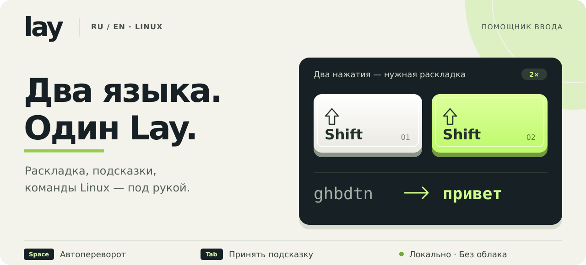
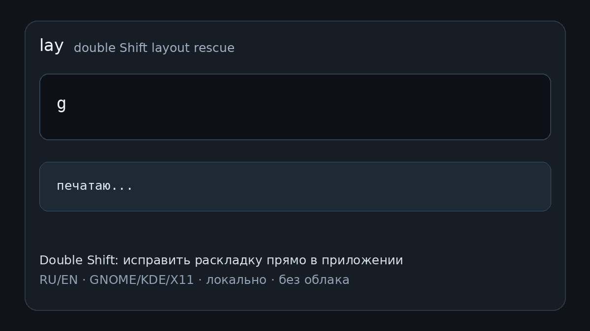

<div align="center">



# Lay — помощник для русского и английского ввода

**Два языка. Один Lay.**

Для тех, кто переключается между русским текстом, английскими словами и терминалом Linux.

[](#install)
[](#demo)

[Возможности](#features) · [Установка](#install) · [Совместимость](#compatibility) · [Вопросы](#faq) · [Документация](#docs) · [English](#english)


[](VERSIONING.md)
[](#compatibility)
[](#license)

</div>

---

## Уже написали `ghbdtn`?

Нажмите <kbd>Shift</kbd> <kbd>Shift</kbd> — последнее слово превратится в `привет`.
Переворот работает в обе стороны: `руддщ` → `hello`.

```text
До                  Действие                После
ghbdtn              Shift → Shift           привет
руддщ               Shift → Shift           hello
```

Lay работает с текущим вводом: для обычного исправления раскладки не нужно
копировать слово, открывать переводчик или заново набирать текст.

<a id="features"></a>

## Меньше исправлений вручную

<table>
<tr>
<td width="50%" valign="top">
<h3>⌨️ Два Shift — слово на месте</h3>
<p>Быстрый ручной переворот RU ↔ EN. По умолчанию исправляется одно последнее слово. После применённой автозамены немедленный Double Shift позволяет вернуть исходный ввод.</p>
</td>
<td width="50%" valign="top">
<h3>↔️ Раскладка следует за текстом</h3>
<p>При включённой автопомощи Lay может перевернуть слово на пробеле и согласовать язык следующей буквы. Словарное подтверждение помогает сохранить нормальные слова обеих раскладок.</p>
</td>
</tr>
<tr>
<td width="50%" valign="top">
<h3>⇥ Продолжение прямо в строке</h3>
<p>IME предлагает окончание во время набора. <kbd>Tab</kbd> принимает актуальную подсказку и добавляет пробел. Подсказки предназначены для буквенного ввода: числа и специальные символы не должны запускать их.</p>
</td>
<td width="50%" valign="top">
<h3>🧠 Ваш выбор имеет значение</h3>
<p>Подтверждённые решения и история использования помогают упорядочивать следующие подсказки. При выборе вариантов Lay также учитывает доступный контекст фразы.</p>
</td>
</tr>
<tr>
<td width="50%" valign="top">
<h3>›_ Подсказки для терминала</h3>
<p>В распознанном терминале английские команды получают приоритет среди подходящих продолжений. Например, для <code>gi</code> Lay может предложить <code>git</code>. Принятие подсказки не запускает команду.</p>
</td>
<td width="50%" valign="top">
<h3>🔒 Локально, под вашим управлением</h3>
<p>Обычный ввод обрабатывается на компьютере, без облачной модели и API-ключа. Автопомощь и автозамена включаются отдельно; для новой установки они выключены.</p>
</td>
</tr>
</table>

### Ещё несколько полезных деталей

- **Опечатки.** Автозамена может исправлять подтверждённые ошибки после границы слова; сомнительный вариант должен остаться без изменения.
- **Аккуратный смешанный текст.** Режим Smart сохраняет нормальные соседние слова: `good ntrcn` → `good текст`.
- **Управление из панели.** Включение Lay, язык, режим ввода, автопомощь, автозамена и диагностика доступны через меню.
- **Прямой выбор RU или EN.** Настраиваемые горячие клавиши включают нужную раскладку без перебора остальных.
- **Конвертация в консоли.** CLI принимает строку или стандартный ввод — удобно для скриптов и уже набранного текста.
- **Настройки сохраняются при обновлении.** Пользовательская конфигурация хранится отдельно от исходников.

<a id="demo"></a>

## Посмотрите в деле



*Запись показывает базовые сценарии; внешний вид интерфейса может отличаться от текущей версии.*

| Ситуация | Как помогает Lay |
|---|---|
| Русское слово набрано латиницей | Два нажатия Shift переворачивают последнее слово |
| В предложении встречается английское слово | Автопомощь проверяет обе раскладки, сохраняя допустимые слова |
| Видите подходящее продолжение | Tab дописывает подсказку и ставит один пробел |
| Часто выбираете один вариант | Подтверждённый выбор участвует в последующем ранжировании |
| Пишете в терминале | Уже доступные командные продолжения получают приоритет |

<a id="install"></a>

## Начните с одного слова

### 1. Установите

```bash
curl -fsSL https://raw.githubusercontent.com/radislabus-star/lay-public/main/scripts/install-remote.sh | bash
```

Установщик скачивает исходники и необходимые данные. После первой установки
**выйдите из пользовательской сессии и войдите снова**: это применяет группу
`input`, доступ к `/dev/uinput` и интеграцию с рабочим столом.

### 2. Попробуйте Double Shift

Включите русскую и английскую раскладки. Наберите `ghbdtn` и дважды быстро нажмите
**левый Shift**. Ожидаемый результат — `привет`.

### 3. Настройте уровень помощи

По умолчанию работает ручной переворот одного слова. Через меню Lay можно отдельно
включить **«Помощь при наборе»** и **«Автозамену»**, настроить область действия и
горячие клавиши. IME-подсказки и принятие Tab требуют активного ввода через Lay/IBus.

<details>
<summary><strong>Обновление, настройки и удаление</strong></summary>

Обновление установленной копии:

```bash
cd ~/projects/lay
bash update.sh
```

Updater сохраняет найденные изменения исходников в именованный `git stash`.
Пользовательские настройки находятся в `~/.config/lay/config.json`.

Удаление программы с сохранением настроек и памяти:

```bash
cd ~/projects/lay
bash uninstall.sh
```

Полное удаление, **включая настройки, память и логи**:

```bash
bash uninstall.sh --purge
```

Локально изменённый checkout автоматически не удаляется.

**Bazzite / Fedora Atomic:** если установщик добавил зависимости в следующий
deployment через `rpm-ostree`, перезагрузите систему и повторите установку.

</details>

<a id="compatibility"></a>

## Для Linux. С основным фокусом на GNOME Wayland

| Окружение | Поддержка |
|---|---|
| **Ubuntu / GNOME Wayland** | Основная среда разработки и наиболее проверенный маршрут |
| **KDE / Plasma Wayland** | Доступен backend; проверенных сценариев меньше |
| **Niri Wayland** | Есть прямой `niri-ipc`; требуется дальнейшая проверка |
| **X11** | Экспериментальный native XKB backend |
| **Другие оконные менеджеры** | Совместимость пока не заявлена |

Расширение GNOME заявляет версии **45, 46, 47 и 50**. Сейчас языковая пара — **RU/EN**.

**Статус — alpha.** Поддержка окружения не гарантирует одинаковую работу каждого
поля приложения. Firefox, терминалы и редакторы по-разному обрабатывают ввод;
отдельные поля Tor Browser и веб-приложений остаются зоной доводки. Подсказки к
командам не заменяют автодополнение вашей оболочки и не покрывают все команды.

В `main` опубликованы исходники **1.0.80**. Эта версия улучшает обработку Reset,
пробела и повторных действий в Firefox. Полная грамматика русского, понимание
целого абзаца и безошибочная работа во всех окнах не заявлены.

[Область проверки 1.0.80](docs/architecture/firefox-input-stability-2026-10-05.md) ·
[Изменения версий](VERSIONING.md) ·
[Доступные релизы](https://github.com/radislabus-star/lay-public/releases)

<a id="faq"></a>

## Несколько важных ответов

<details>
<summary><strong>Нужны интернет, подписка или облачная модель?</strong></summary>

Для обычного набора и ручного переворота — нет. Установка и обновление скачивают
файлы, но базовый маршрут обрабатывает ввод локально. Облачная LLM и API-ключ не нужны.

</details>

<details>
<summary><strong>Что происходит с набранным текстом?</strong></summary>

Демон читает клавиатурные события локально, чтобы распознавать жест и последнее
слово. По умолчанию обычный маршрут не отправляет текст в сеть и не ведёт полный
журнал нажатий. Диагностика включается отдельно. Включённая персонализация и
автокоррекция могут сохранять локальную историю использования; эти данные остаются
на устройстве. Текст также может попадать в явно включённые диагностические журналы.

</details>

<details>
<summary><strong>Lay понимает всё предложение и исправляет любой текст?</strong></summary>

Lay учитывает доступный контекст и подтверждённые решения при выборе из кандидатов.
Это не гарантия понимания смысла или правильного окончания. Основной сценарий
работает с недавно набранным хвостом; произвольное слово под курсором, выделение
или весь документ не являются универсальной областью исправления.

</details>

<details>
<summary><strong>Можно использовать Lay из скрипта?</strong></summary>

Да. Конвертация раскладки доступна через CLI:

```bash
lay "Ye djn ghbvth"
# Ну вот пример

lay "руддщ цщкдв"
# hello world

echo "ghbdtn" | lay
# привет
```

</details>

<a id="docs"></a>

## Для тех, кто хочет разобраться глубже

[Документация](docs/README.md) · [Как это работает](HOW_IT_WORKS.md) ·
[Архитектура](ARCHITECTURE.md) · [Настройки и меню](docs/lay-menu-settings-architecture.md) ·
[Сообщить об ошибке](https://github.com/radislabus-star/lay-public/issues)

Lay написан на **Rust** и использует Linux-ввод, IBus и интеграцию с рабочим столом.
Генерация вариантов, их выбор и проверенное применение разделены: подсказка сама
по себе не даёт права заменить текст.

Разработка и обязательные проверки описаны в [DEVELOPMENT.md](DEVELOPMENT.md).
Минимальный Rust для default features и `lexical-compiler` — **1.88.0**;
рабочий toolchain и исключения — в [Rust Toolchain Policy](docs/rust-toolchain-policy.md).

<a id="license"></a>

## Лицензия

**Бесплатно для некоммерческого использования** по [Lay Non-Commercial License](LICENSE):
личные задачи, обучение, исследование и тестирование. Для коммерческого
использования требуется отдельное письменное разрешение правообладателей.

<a id="english"></a>

## English, briefly

**Lay is a local RU/EN typing assistant for Linux.** Double-tap the left Shift to
repair the last word typed in the wrong layout: `ghbdtn` → `привет`. Optional
typing assistance, inline IBus completion with Tab, confirmed-choice preferences
and terminal-command priority help with everyday mixed-language input.

GNOME Wayland is the primary target; other backends have smaller coverage. The
project is alpha, field compatibility varies, and only RU/EN is currently supported.
The normal typing path needs no cloud API. Source version: **1.0.80**.

[Install](#install) · [Documentation](docs/README.md) · [Non-Commercial License](LICENSE)

---

<div align="center">

**Исправьте раскладку. Примите подсказку. Пишите дальше.**

[Установить Lay ↑](#install) · [Исходники](https://github.com/radislabus-star/lay-public) · [Обратная связь](https://github.com/radislabus-star/lay-public/issues)

</div>
