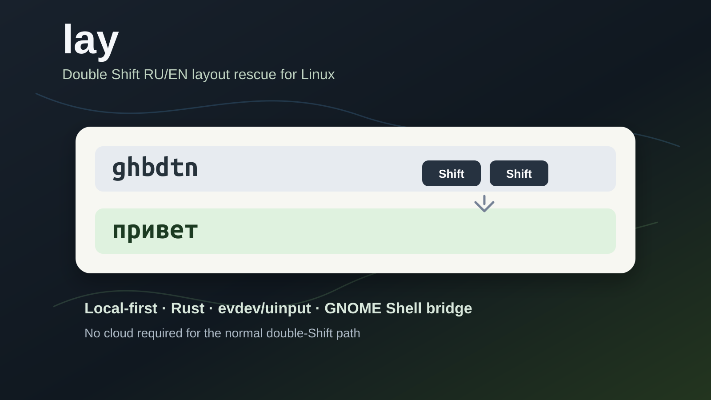

# Double Shift вместо ручного удаления: локальный помощник раскладки для Linux



На Windows я привык к Caramba Switcher. Это была одна из тех маленьких утилит,
которые почти не замечаешь, пока они есть: набрал слово не в той раскладке,
нажал привычную горячую клавишу, слово перевернулось, можно писать дальше.

После перехода на Linux я ожидал найти что-то такое же простое. Нашёл несколько
похожих проектов, но одни выглядели устаревшими, другие не работали в моём
GNOME Wayland окружении, третьи решали задачу не так, как мне хотелось. Мне
нужно было не большое приложение-автокорректор, а один конкретный рефлекс:
нажал Shift два раза — последнее слово перепечаталось в другой раскладке.

Я не нашёл готовую утилиту, которая делала бы это достаточно стабильно, поэтому
написал свою.

Главное действие должно было быть таким:

```text
набрал не в той раскладке -> нажал Shift два раза -> слово стало нормальным
```

Так появился `lay`: локальный помощник для Linux desktops, который исправляет
последнее слово по double Shift и умеет осторожно помогать при наборе после
пробела. GNOME Wayland остаётся основным проверенным путём, но сейчас в проекте
уже есть backend'ы для KDE Plasma и X11.

Примеры:

```text
ghbdtn          -> привет
good ntrcn     -> good текст
Главное Вщгиду -> Главное Double
wi-fi ye       -> wi-fi ну
перпаратов     -> препаратов
```


Проект ещё alpha, но для ежедневного RU/EN набора он уже стал рабочим
инструментом. Если кому-то тоже не хватает лёгкого double Shift исправления
слов под Linux, репозиторий открыт.

Ниже не рекламный текст, а инженерский разбор: что оказалось простым, что
неожиданно сложным и почему на Wayland всё не сводится к "взял текст из
активного окна и заменил".

## Почему это не просто "сделать Punto Switcher"

На X11 такие задачи исторически были проще. Приложения жили в более открытой
среде: можно было перехватывать ввод, узнавать активное окно, где-то читать или
подменять текст. Это удобно для утилит, но не очень приятно с точки зрения
безопасности.

GNOME Wayland устроен строже. И это правильно: случайная программа не должна
легко читать любой ввод из любого окна и менять текст где захочет. Но для
клавиатурного помощника это означает, что привычная архитектура "посмотрел
текст, заменил текст" не подходит.

Поэтому я сразу зафиксировал несколько ограничений:

- обычный double Shift не должен использовать облако;
- не надо строить основной путь вокруг буфера обмена;
- программа должна работать локально и предсказуемо;
- если пользователь явно нажал hotkey, его намерение важнее "умного" мнения
  модели;
- лучше молчать, чем исправлять слишком смело.

Из этих ограничений выросла текущая архитектура.

## Базовая идея: replay физических клавиш

Самый надёжный сценарий выглядит почти примитивно.

Если я набрал `ghbdtn`, программа не обязана знать слово `привет`. Она может
запомнить физические клавиши, стереть набранное слово, переключить раскладку и
проиграть те же keycode-события заново.

Упрощённая схема:

```text
physical keyboard
    -> evdev
    -> lay-daemon
    -> word buffer
    -> Backspace x N
    -> GNOME Shell extension switches layout
    -> uinput replays original keycodes
```

То есть `lay` работает не как текстовый редактор, а как маленький рефлекс
клавиатуры.

Компонентов два:

- `lay-daemon` на Rust слушает клавиатуру через evdev, хранит короткий буфер,
  распознаёт double Shift и печатает обратно через uinput;
- GNOME Shell extension показывает меню в трее и даёт daemon-у session-local
  DBus bridge для переключения раскладки внутри GNOME Shell.

Такой путь хорошо подходит для главного случая:

```text
ghbdtn -> привет
руддщ -> hello
```

Но реальный набор быстро ломает красивую простоту.

## Где начинается сложность

Одинарное последнее слово ещё можно просто перевернуть. А вот смешанный текст
сразу подбрасывает неприятные случаи.

Например:

```text
good ntrcn
```

Здесь `good` уже нормальное английское слово. Трогать его нельзя. А `ntrcn`
надо превратить в `текст`.

Или:

```text
Главное Вщгиду
```

Первое слово уже нормальное русское, второе надо сделать `Double`.

Или короткий технический пример:

```text
AmoCRM Z тут задача
```

Если тупо перевернуть весь хвост, можно испортить `AmoCRM`, а нужно только
превратить `Z` в `Я`.

После таких кейсов стало понятно: "два слова" не должны означать "перевернуть
два слова целиком". Scope и способ исправления нужно разделить.

Сейчас в `lay` это выглядит так:

- scope отвечает только за то, сколько хвоста взять: одно слово, два слова;
- engine решает, что именно делать с этим хвостом;
- smart-режим анализирует токены отдельно;
- хороший соседний токен остаётся на экране;
- плохой диапазон удаляется и вставляется минимально.

Пример минимальной замены:

```text
Главное Вщгиду -> Главное Double
```

`Главное` не перепечатывается. Стирается только `Вщгиду`, вставляется `Double`.

Это важно не только для скорости. Чем меньше программа трогает текст, тем меньше
шансов, что она сломает каретку, пробел, выделение или поведение конкретного
приложения.

## Почему я не сделал LLM главным мозгом

Я пробовал маленькие локальные модели как арбитра: дать модели два варианта и
спросить, какой выглядит естественнее.

Идея красивая, но для manual hotkey она не стала главным решением.

Главная проблема даже не скорость. Главная проблема в контракте с пользователем.
Если я нажал double Shift на слове `Double`, я могу действительно хотеть
получить `Вщгиду`. Программа не должна отвечать: "Double выглядит нормальным
английским словом, я лучше ничего не сделаю".

Для ручного действия важнее предсказуемость:

```text
нажал double Shift -> текст должен перевернуться
```

Модель может быть полезна в неоднозначных случаях, но она не должна отменять
явное действие пользователя.

В итоге основной путь стал скучнее, но надёжнее:

- deterministic layout mapping;
- RU/EN словари;
- char n-gram scorer;
- защита технических ASCII-токенов;
- tokenwise-логика для смешанных хвостов;
- optional LLM только как экспериментальный арбитр, а не как главный мотор.

## Typing assist: помощь после пробела

Позже появился отдельный режим: помощь при наборе после пробела.

Это уже не manual double Shift. Пользователь просто печатает, нажимает пробел,
а `lay` смотрит на завершённый хвост и исправляет только очень уверенные
локальные ошибки.

Примеры:

```text
рабоатет     -> работает
ошисбя       -> ошибся
помагу       -> помогу
видешь       -> видишь
кнокопками   -> кнопками
перпаратов   -> препаратов
njkmrj       -> только
```

Здесь принцип другой: никакого свободного переписывания текста. Не надо
додумывать смысл, менять стиль или превращать программу в агрессивный
автокорректор.

Typing assist сейчас ловит ограниченные классы ошибок:

- перестановка соседних букв;
- лишняя повторная или случайно вставленная буква;
- некоторые ошибки гласных;
- часть глагольных окончаний;
- случайно разорванное пробелом слово;
- уверенная неправильная раскладка после пробела;
- точные пользовательские правила из конфигурации.

Каждый новый живой пример я стараюсь превращать не в production-hardcode, а в
регрессионный тест. Это дисциплинирует: пример остаётся в тестах, а runtime
логика должна быть общей.

## IME/preedit: почему это отдельный режим

Очень хотелось сделать предикцию: пишешь `сл`, а в поле серым появляется `ово`;
нажал Tab, и получилось `слово`.

Логика предсказания не такая страшная. Трудная часть — визуализация внутри
чужого поля ввода.

Текущая архитектура `lay` умеет печатать, стирать, переключать раскладку и
иногда делать text commit через GNOME Shell bridge. Но она не может универсально
сказать каждому приложению: "нарисуй этот ghost-text серым, но не считай его
настоящим текстом".

Нормальный способ для такого поведения — input method/preedit, например через
IBus или Fcitx. Поэтому в `lay` появился отдельный экспериментальный IME
backend: он может показывать preedit-кандидат прямо в поле и принимать его через
Tab.

Я пробовал визуальные эффекты через выделение и вмешательство в поле. Практика
быстро охладила: терминалы, каретка, выделение и разные приложения начинают
вести себя по-разному. Для утилиты, которая должна помогать при наборе, это
слишком высокая цена.

Поэтому IME в `lay` — не замена основному пути, а отдельный режим отображения.
Решение по-прежнему строит общий core: double Shift, typing assist, безопасные
кандидаты. IME только показывает подсказку и применяет готовое действие.

## Приватность

Клавиатурная утилита должна вызывать здоровую подозрительность.

`lay-daemon` видит события клавиатуры. Иначе такую задачу на GNOME Wayland не
сделать. Поэтому важен не лозунг "у нас всё безопасно", а конкретная модель
данных.

Что сейчас заложено:

- обычный double Shift работает локально;
- облако не требуется;
- буфер обмена не используется как основной канал;
- полный поток набора не пишется в лог;
- learning log опциональный;
- статистика хранит счётчики, а не набранный текст;
- пользовательские правила и protected words лежат локально.

Это не отменяет того, что программа работает близко к клавиатуре. Но код и
поведение должны быть достаточно простыми, чтобы их можно было проверить.

## Что оказалось самым неприятным

Самые сложные баги были не в конвертации `ghbdtn -> привет`. Это как раз
лёгкая часть.

Больнее были поведенческие детали:

- приложение не успело стереть последний символ перед вставкой;
- терминал принял ввод иначе, чем GTK-поле;
- `wi-fi` нельзя считать обычным словом;
- `AmoCRM` нельзя портить как мусорную смесь регистра;
- `2 слова` нельзя привязывать к LLM;
- space не должен участвовать в определении раскладки;
- если меняется только второе слово, первое не надо перепечатывать;
- автопомощь не должна превращать нормальные слова в "улучшенные" кандидаты.

В какой-то момент стало ясно, что главный навык такой утилиты — не "быть умной",
а не лезть туда, где сигнал слабый.

## Текущий статус

Сейчас `lay` — alpha для Linux desktops и RU/EN раскладок.

Лучше всего проверен Ubuntu/GNOME Wayland. Extension заявляет поддержку GNOME
Shell 45, 46, 47 и 50.

KDE Plasma и X11 уже поддержаны через отдельные backend'ы, но покрытие по чужим
дистрибутивам пока меньше, чем у GNOME. Sway, Hyprland и раскладки кроме RU/EN
могут потребовать отдельной доработки.

Установка:

```bash
git clone https://github.com/radislabus-star/lay-public.git ~/projects/lay
cd ~/projects/lay
bash install.sh
```

После установки может понадобиться новый вход в сессию, чтобы применились права
на `input` и GNOME extension.

Репозиторий: [github.com/radislabus-star/lay-public](https://github.com/radislabus-star/lay-public)

## Что дальше

Ближайшие понятные задачи:

- сделать installer/uninstaller аккуратнее;
- продолжать расширять regression suite живыми примерами;
- лучше описать privacy-модель;
- расширять матрицу KDE/X11 на реальных системах;
- доводить экспериментальный IME/preedit-режим, не превращая его в отдельный
  correction brain;
- собрать обратную связь от пользователей, которые много пишут на RU/EN.

`lay` не претендует быть большим автокорректором. Это маленькая утилита для
одного главного действия: быстро исправить слово или короткий хвост, набранный
не в той раскладке.

Если вы живёте между русской и английской раскладками, мне особенно интересны
короткие воспроизводимые кейсы: что набрали, что ожидали, что получилось.
Именно такие примеры сильнее всего двигают проект вперёд.
